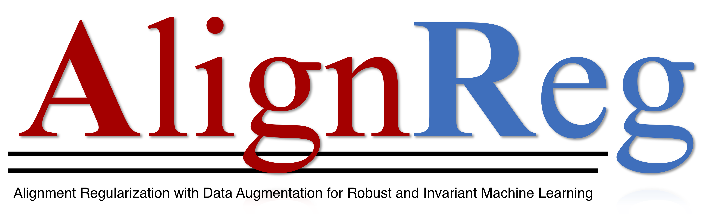

# AlignReg

Implementation of the AlignReg package associated with the following paper:

   Haohan Wang, Zeyi Huang, Xindi Wu, and Eric P. Xing. 2022. [Toward Learning Robust and Invariant Representations with Alignment Regular- ization and Data Augmentation](https://arxiv.org/abs/2011.13052). In Proceedings of the 28th ACM SIGKDD Conference on Knowledge Discovery and Data Mining (KDD ’22), August 14–18, 2022, Washington, DC, USA. ACM, New York, NY, USA,
   
The package is organized by Hanru Yan

This package implements the algorithm using squared l2 norm as consistency loss for augmented data presented in arXiv:2011.13052, in both TensorFlow and PyTorch. For an iPython example, see [here](https://github.com/jyanln/AlignReg/blob/main/examples.ipynb)
